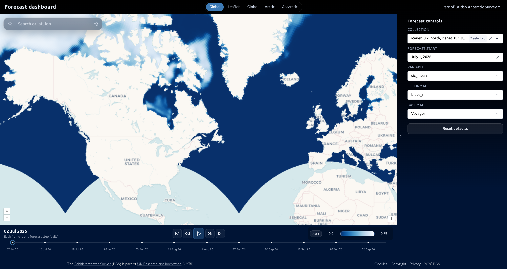

# environmental-stac-dashboard

Plotly Dash dashboard for visualising earth system forecast predictions from [environmental-stac-generator](https://github.com/environmental-forecasting/environmental-stac-generator) COGs, deployed with [environmental-stac-orchestrator](https://github.com/environmental-forecasting/environmental-stac-orchestrator).



> [!WARNING]
> Not intended as a standalone production deploy. Use the orchestrator stack for full forecast visualisation (STAC API, tiler, file server).

## Quick start (local development)

```bash
pip install -r requirements.txt
make run
```

Open [http://localhost:8005](http://localhost:8005).

## Documentation

Local development, leadtime scrub benchmarks, and related projects:

```bash
make docs-install
make docs
```

Then open http://127.0.0.1:8000.
